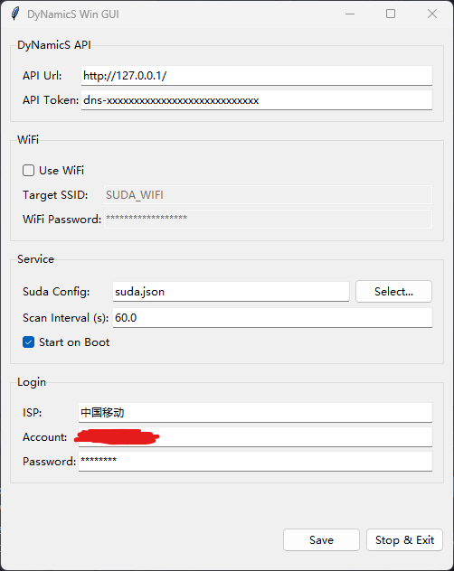

# Client

用于自动登录且定时上报IP至DyNamicS API的脚本。  
**IP上报目前未实现**

## 如何使用

### 版本说明

对于Windows用户，可以使用`client_wingui.py`。这是具有GUI配置界面的应用程序，支持托盘常驻、开机自启。



为了使用方便，GUI版本用`Pyinstaller`打包的可执行文件可以在发行版中找到，下载解压后即可使用。

对于Linux用户或者不需要GUI界面的用户，可以使用`client.py`。这是无GUI界面的版本。只能手动修改配置文件，同时不支持开机自启功能。

无GUI版本若需可执行文件，请自行打包。

### GUI使用说明

自动开启托盘常驻功能，直接关闭窗口不会退出程序。右键托盘图标弹出快捷菜单。


使用GUI修改配置时，需要手动点击Save按钮更新配置文件，否则不会生效。

点击Stop&Exit按钮退出程序。

**若启用了开机自启，请不要再变更程序的位置。**

## 配置文件说明

### suda.json

用于配置与苏大校园网登录交互逻辑的文件。

```json
{
    "base_url": "http://10.9.1.3/",
    "api_url": "http://10.9.1.3:801/eportal/",
    "ip_regex": "v46?ip='([.0-9]+)'",
    "login_sign": "v4ip",
    "file_ver_regex": "var fileVersion=\"([0-9]+)\"",
    "isp_url": "http://10.9.1.3:801/eportal/extern/SZDX/ip/3/pc.js?v=_%s",
    "isp_regex": "<option.*? value=\"([-@a-z0-9]*)\".*?>(.*?)<\\/option>",
    "login_params": {
        "c": "Portal",
        "a": "login", 
        "login_method": "1",
        "user_account": "{account}{isp_sign}",
        "user_password": "{password}",
        "wlan_user_ip": "{user_ip}",
        "v": "{rand_num}"
    },
    "add_isp": {}
}
```

### service.json

用于配置脚本行为的文件。

```json
{
    "api_url": "http://127.0.0.1/",
    "api_token": "dns-xxxxxxxxxxxxxxxxxxxxxxxxxxxx",
    "use_wifi": false,
    "target_ssid": "WIFI_SSID",
    "wifi_password": "wifi_password",
    "suda_config_path": "suda.json",
    "scan_interval": 60.0,
    "start_on_boot": false,
    "isp": "中国移动",
    "account": "account",
    "password": "password",

    "advanced_flags": {
        "full_admin_mode": false,
        "interface_reboot": {
            "enabled": false,
            "interface": "EitherNet",
            "wait_duration": 10.0,
            "disable_cmd": "netsh interface set interface \"%s\" admin=disable",
            "enable_cmd": "netsh interface set interface \"%s\" admin=enable"
        }
    }
}
```

- `api_url`: DyNamicS API接口的URL。
- `api_token`: DyNamicS API接口的令牌，用于身份验证。
- `use_wifi`: 是否使用WiFi连接校园网。如果设置为`true`，则会在无网络连接时，尝试通过WiFi连接校园网。使用时必须先开启WiFi。
- `target_ssid`: 目标SSID，即要连接的WiFi名称。
- `wifi_password`: WiFi密码。
- `suda_config_path`: SUDA配置文件的路径，用于指定SUDA配置文件的位置。
- `scan_interval`: 网络状态检查的间隔时间，单位为秒。
- `start_on_boot`: 是否开机自启，使用非GUI版本时无效。
- `isp`: 选择运营商。
- `account`: 账号名。
- `password`: 密码。
- `advanced_flags`: 高级配置项，无法通过GUI修改。

### 高级配置项说明

#### full_admin_mode

type: bool

是否在程序进入时就请求管理员权限。

#### interface_reboot

type: object

是否在有线网络连接失败时尝试重启网卡？  
**必须启用interface_reboot**

```json
{
    "enabled": false,
    "interface": "EitherNet",
    "wait_duration": 10.0,
    "disable_cmd": "netsh interface set interface \"%s\" admin=disable",
    "enable_cmd": "netsh interface set interface \"%s\" admin=enable"
}
```

- `enabled`: 是否启用
- `interface`: 网络接口名称
- `wait_duration`: 操作网络接口的延时
- `disable_cmd`: 禁用网络接口使用的命令
- `enable_cmd`: 启用网络接口使用的命令
